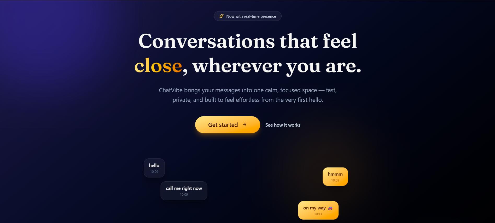
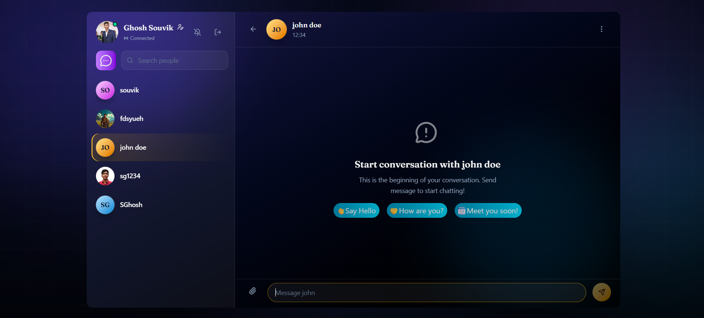

# 💬 ChatVibe

  

A modern real-time chat application built with the MERN stack and Socket.IO, featuring a sleek dark UI, instant messaging, online presence, image sharing, and responsive design.

---

## ✨ Features

- 🔐 Secure user authentication
- 💬 Real-time messaging with Socket.IO
- 🟢 Live online/offline presence
- 🔔 Instant message notifications
- 🖼️ Image sharing in chats
- 👤 Profile update support
- 🔍 Search users
- 📱 Fully responsive interface
- 🌙 Modern dark theme
- ⚡ Fast and smooth user experience

---

## 🖥️ Preview

### Landing Page

### Chat Interface

---

## 🛠️ Tech Stack

### Frontend
- React.js
- Vite
- Tailwind CSS
- DaisyUI
- Zustand
- Axios
- Socket.IO Client

### Backend
- Node.js
- Express.js
- MongoDB
- Mongoose
- Socket.IO
- JWT Authentication
- Cloudinary (Image Upload)

---

## 🌟 Highlights

- Beautiful glassmorphism-inspired interface
- Real-time chat without page refresh
- Automatic scrolling to newest messages
- Responsive layout for desktop and mobile
- Clean and minimal user experience

---

## 👨‍💻 Author

**Souvik Ghosh**

If you like this project, consider giving it a ⭐ on GitHub!
